# Rebuilder Template

Point an AI coding agent at a legacy codebase. Get a modern rebuild with tested code, automated quality gates, and a deployable SRE agent — without filling out a single document by hand.

## Quick Start

**Windsurf** — open this repo and tell Cascade:
> *"Rebuild my-service"*

**VS Code + Copilot** — open this repo and tell Copilot:
> *"Read rebuild/IDEATION_PROCESS.md and rebuild my-service"*

That's it. The agent handles the rest.

## How It Works

Three phases — each feeds into the next:

**Phase 1 — Analyze:** The agent reads the legacy codebase and produces a PRD, architecture decisions, and populated agent configs. All outputs land in the **destination repo** (e.g., `rebuilder-evergreen-tvevents/`). You review before anything is built.

**Phase 2 — Build:** Tell the agent to create a new repo and build from the PRD. The developer agent writes the code; the QA agent independently verifies it.

**Phase 3 — Operate:** Deploy the SRE agent from `sre-agent/runtime/`. It receives monitoring alerts, diagnoses issues via `/ops/*` endpoints on your service, and escalates to PagerDuty when it can't resolve.

> [!NOTE]
> By default the process pauses between Phase 1 and Phase 2 so you can review the PRD before code is written. To skip the pause, add *"run all steps including the build"* to your prompt.

## Language Support

| Language | Developer Agent | QA Agent |
|---|---|---|
| Python | `python-developer-agent/` | `python-qa-agent/` |
| C | `c-developer-agent/` | `c-qa-agent/` |
| Go | `go-developer-agent/` | `go-qa-agent/` |

All rebuilt services are **API-first** with `/ops/*` endpoints for automated diagnostics, instrumented with Google SRE best practices (Golden Signals, RED method, SLOs).

This is **not** for greenfield products. It assumes you have a running application you want to rebuild with a modern stack, better architecture, or improved observability.

## Architecture Overview

```mermaid
flowchart LR
    subgraph P1 ["Phase 1 — Analyze"]
        direction TB
        IN["scope.md + input.md<br/>repo/ + template/ + adjacent/"]
        RUN["run.sh → IDEATION_PROCESS.md<br/>(18 steps)"]
        OUT["PRD, ADRs, agent configs,<br/>feature parity, data mapping"]
        IN --> RUN --> OUT
    end

    subgraph P2 ["Phase 2 — Build"]
        direction TB
        COPY["Copy configs →<br/>new target repo"]
        SHIM["IDE shim auto-loads<br/>{lang}-developer-agent/skill.md<br/>+ config.md + template/skill.md"]
        BUILD["AI agent builds service<br/>from PRD + standards"]
        COPY --> SHIM --> BUILD
    end

    subgraph P3 ["Phase 3 — Operate"]
        direction TB
        ALERT["Monitoring alert fires"]
        SRE["SRE agent diagnoses<br/>via /ops/* endpoints"]
        ACT["Remediates or<br/>escalates to PagerDuty"]
        ALERT --> SRE --> ACT
    end

    OUT -->|"populated configs + PRD"| COPY
    BUILD -->|"deployed service with<br/>/ops/* endpoints"| ALERT

    style P1 fill:#e8f4f8,stroke:#2c7bb6
    style P2 fill:#e8f0e4,stroke:#4daf4a
    style P3 fill:#fef3e0,stroke:#ff7f00
```

## What Gets Generated

The agent produces everything you need:

- **Analysis** — legacy assessment, modernization opportunities, feasibility, rebuild candidates
- **PRD** — product requirements with infrastructure migration plan
- **Architecture** — decision records, feature parity matrix, data migration mapping
- **Agent configs** — populated developer, QA, and SRE agent files for your specific project
- **Built service** — tested code, CI/CD pipeline, Terraform, `/ops/* endpoints, OpenAPI spec

All outputs land in the destination repo.

## Detail Documentation

- **[Full How-to Guide](docs/readme-details/how-to-use.md)** — Phase-by-phase instructions, quick reference
- **[Architecture & File Map](docs/readme-details/architecture.md)** — Detailed diagrams, which file does what
- **[Agents Reference](docs/readme-details/agents.md)** — Developer, QA, SRE, Performance agents
- **[Standards Loading & Verification](docs/readme-details/standards-loading-and-verification.md)** — WHERE and WHEN each standard is loaded and enforced
- **[Repository Structure](docs/readme-details/repository-structure.md)** — Complete directory tree
- **[IDE Compatibility](docs/readme-details/ide-compatibility.md)** — Windsurf, VS Code, Enterprise, Cursor

---

**Download all diagrams as [PDF](docs/rebuilder-architecture-diagrams.pdf)**

