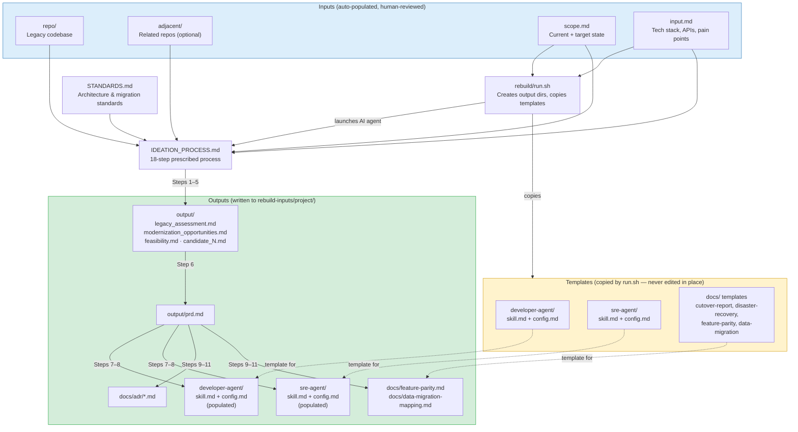
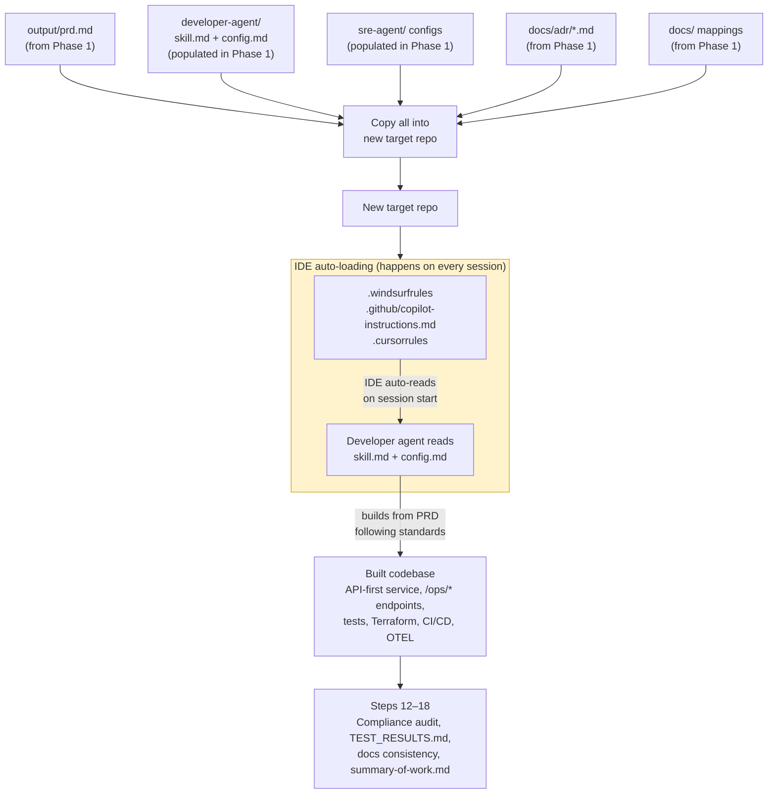
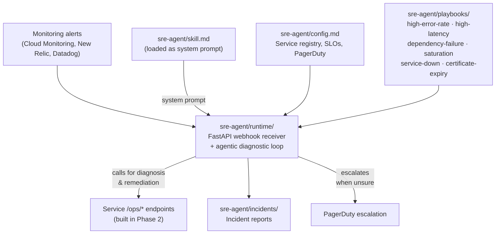

# Rebuilder Template

Structured process for analyzing legacy applications, producing rebuild and infrastructure migration plans, and generating the agent configurations that carry those standards into development and operations.

## What This Is

A three-phase workflow for legacy application rebuilds:

1. **Analyze** — Point an AI coding agent at a legacy codebase (and optionally its adjacent repos). It fills out the input documents, runs an 18-step analysis (IDEATION_PROCESS.md), and produces a PRD, architecture decision records, and auto-populated agent configs.
2. **Build** — Create a new repo for the rebuilt application. Copy the populated agent configs into it. Use the developer agent instructions to build the service from the PRD.
3. **Operate** — Deploy the SRE agent. It receives alerts from your monitoring platform (GCP Cloud Monitoring, New Relic, Datadog, etc.), diagnoses issues using the `/ops/*` endpoints your service exposes, takes safe remediation actions, and escalates to humans via PagerDuty when it cannot confidently resolve an issue.

This is **not** for greenfield products. It assumes you already have a running application and want to rebuild it with a modern stack, better architecture, or improved observability.

All rebuilt services follow an **API-first** design — every feature is exposed and testable through APIs. Services include **SRE agent endpoints** (`/ops/*`) for automated diagnostics and safe remediation, instrumented with **Google SRE best practices** (Golden Signals, RED method, SLOs with error budgets).

## How the Template Files Relate

Each phase feeds into the next. The overview shows the big picture; the per-phase diagrams show every file.

#### Overview — Three Phases

```mermaid
flowchart LR
    subgraph P1 ["Phase 1 — Analyze"]
        direction TB
        IN["scope.md + input.md<br/>repo/ + adjacent/"]
        RUN["run.sh → IDEATION_PROCESS.md<br/>(18 steps)"]
        OUT["PRD, ADRs, agent configs,<br/>feature parity, data mapping"]
        IN --> RUN --> OUT
    end

    subgraph P2 ["Phase 2 — Build"]
        direction TB
        COPY["Copy configs →<br/>new target repo"]
        SHIM["IDE shim auto-loads<br/>developer-agent/skill.md<br/>+ config.md"]
        BUILD["AI agent builds service<br/>from PRD + standards"]
        COPY --> SHIM --> BUILD
    end

    subgraph P3 ["Phase 3 — Operate"]
        direction TB
        ALERT["Monitoring alert fires"]
        SRE["SRE agent diagnoses<br/>via /ops/* endpoints"]
        ACT["Remediates or<br/>escalates to PagerDuty"]
        ALERT --> SRE --> ACT
    end

    OUT -->|"populated configs + PRD"| COPY
    BUILD -->|"deployed service with<br/>/ops/* endpoints"| ALERT

    style P1 fill:#e8f4f8,stroke:#2c7bb6
    style P2 fill:#e8f0e4,stroke:#4daf4a
    style P3 fill:#fef3e0,stroke:#ff7f00
```



---

#### Phase 1 — Analyze (detail)

`run.sh` copies templates into the project directory and invokes the AI agent, which follows `IDEATION_PROCESS.md` to produce all outputs.



---

#### Phase 2 — Build (detail)

Phase 1 outputs are copied into a new repo. IDE shim files auto-load the developer agent standards on every session.



---

#### Phase 3 — Operate (detail)

The SRE agent receives monitoring alerts, diagnoses issues via the service's `/ops/*` endpoints, and remediates or escalates.



### Quick Reference: Which File Does What

The rebuilder is a fully automated process — the AI agent reads the legacy codebase and populates all files. Humans review and adjust before proceeding, but do not need to fill anything out manually.

| File | Role | When It's Used |
|---|---|---|
| `scope.md` | Defines current app + target state | Auto-populated from legacy code; human reviews/adjusts before proceeding |
| `rebuild/input.md` | Detailed tech stack, APIs, pain points | Auto-populated from legacy code; human reviews/adjusts before proceeding |
| `rebuild/run.sh` | Creates output dirs, copies templates, launches AI agent | Start of Phase 1 |
| `rebuild/IDEATION_PROCESS.md` | 18-step prescribed analysis + build process | AI agent follows during Phases 1 & 2 |
| `STANDARDS.md` | Architecture, scaling, security, testing standards | Referenced throughout all phases |
| `.windsurfrules` | IDE shim — tells Windsurf to read `developer-agent/skill.md` + `config.md` | Auto-read by Windsurf on every session start |
| `.github/copilot-instructions.md` | IDE shim — tells VS Code Copilot to read `developer-agent/skill.md` + `config.md` | Auto-included in every Copilot Chat interaction |
| `.cursorrules` | IDE shim — tells Cursor to read `developer-agent/skill.md` + `config.md` | Auto-read by Cursor on every session start |
| `developer-agent/skill.md` | Dev coding standards (template → populated) | Template in Phase 1; auto-loaded by IDE shims in Phase 2 |
| `developer-agent/config.md` | Project-specific dev config (template → populated) | Template in Phase 1; auto-loaded by IDE shims in Phase 2 |
| `sre-agent/skill.md` | SRE diagnostic workflow + safety constraints | Template in Phase 1; system prompt in Phase 3 |
| `sre-agent/config.md` | Service registry, SLOs, PagerDuty config | Template in Phase 1; runtime config in Phase 3 |
| `sre-agent/playbooks/*.md` | Remediation runbooks by incident type | Phase 3 — agent follows during incidents |
| `sre-agent/runtime/` | Deployable FastAPI service for alert handling | Phase 3 — receives webhooks, runs agentic loop |
| `docs/*.md` | Migration planning templates (feature parity, data mapping, DR, cutover) | Templates copied in Phase 1; filled during Phases 1–2 |
| `output/*.md` | Analysis artifacts + PRD | Written by AI agent in Phase 1 |

## Repository Structure

```
replicator/
├── STANDARDS.md                # Migration reference — architecture, data migration, cutover, DR, ADRs
├── README.md                  # This file
├── spec-driven-development.md # Leadership doc — reproducibility, agent architecture
├── scope.md                   # Scope template — copy to a working directory before filling out
├── prompting.md               # Audit trail of prompting commands and outcomes
├── .gitignore                 # Python, Terraform, IDE, OS ignores + rebuild-inputs/
├── .windsurfrules             # Windsurf IDE — loads developer-agent/skill.md + config.md
├── .github/
│   ├── copilot-instructions.md    # VS Code Copilot — loads developer-agent/skill.md + config.md
│   ├── PULL_REQUEST_TEMPLATE.md   # PR template — engineer sign-off
│   └── workflows/
├── rebuild/
│   ├── IDEATION_PROCESS.md    # The rebuild analysis process definition (18 steps)
│   ├── input.md               # Input template — copy to a working directory before filling out
│   └── run.sh                 # Runner script — creates output structure in the input directory
├── rebuild-inputs/            # Per-project working directories (gitignored)
│   └── <project-name>/       # One directory per rebuild project
│       ├── repo/                         # Cloned primary legacy codebase
│       ├── adjacent/                     # Optional: related repos included in rebuild scope
│       │   └── <related-repo>/
│       ├── scope.md                      # Filled-out scope
│       ├── input.md                      # Filled-out input
│       ├── output/                       # Steps 1-6: analysis artifacts and PRD
│       │   ├── legacy_assessment.md
│       │   ├── modernization_opportunities.md
│       │   ├── feasibility.md
│       │   ├── candidate_N.md
│       │   ├── prd.md
│       │   ├── summary-of-work.md         # Build summary — what was built, commits, quality gates
│       │   ├── compliance-audit.md        # Compliance audit results
│       │   └── process-feedback.md        # Process improvement notes
│       ├── developer-agent/              # Step 8: populated dev agent config
│       │   ├── skill.md
│       │   └── config.md
│       ├── sre-agent/                    # Step 7: populated SRE agent config
│       │   ├── skill.md
│       │   └── config.md
│       └── docs/
│           ├── adr/                      # Step 9: architecture decision records
│           │   └── *.md
│           ├── feature-parity.md         # Step 10: feature parity matrix
│           ├── data-migration-mapping.md  # Step 11: schema mapping
│           ├── cutover-report.md         # Template — filled post-cutover
│           └── disaster-recovery.md      # Template — filled during ops setup
├── docs/                      # Migration planning document templates
│   ├── data-migration-mapping.md  # Schema mapping between legacy and target
│   ├── feature-parity.md         # Feature parity matrix and status tracking
│   ├── cutover-report.md         # Post-cutover documentation
│   ├── disaster-recovery.md      # DR plan — RTO/RPO, backups, runbooks
│   ├── adr/                      # Template directory (generated ADRs go in rebuild-inputs/)
│   │   └── .gitkeep
│   └── postmortems/              # Incident postmortems
│       └── .gitkeep
├── developer-agent/
│   ├── README.md              # Developer agent overview
│   ├── skill.md               # Daily dev instructions template — coding, testing, CI/CD, environments, bootstrap
│   ├── config.md              # Per-project config template — commands, environments, services, CI/CD
│   ├── .windsurfrules         # Windsurf IDE hook — reads skill.md + config.md on session start
│   └── .github/
│       └── copilot-instructions.md  # VS Code Copilot hook
├── sre-agent/
│   ├── README.md              # SRE agent overview
│   ├── skill.md               # SRE agent instructions template — diagnostic workflow and response framework
│   ├── config.md              # Per-project config template — service registry, SLOs, PagerDuty, escalation
│   ├── playbooks/             # Remediation playbooks by incident type
│   │   ├── high-error-rate.md
│   │   ├── high-latency.md
│   │   ├── dependency-failure.md
│   │   ├── saturation.md
│   │   ├── service-down.md
│   │   └── certificate-expiry.md
│   ├── incidents/             # Agent-written incident reports
│   │   └── .gitkeep
│   └── runtime/               # SRE agent runtime service
│       ├── README.md          # Architecture, setup, and deployment guide
│       ├── main.py            # FastAPI webhook receiver + alert intake pipeline
│       ├── agent.py           # Agentic loop — OpenAI-compatible LLM orchestration
│       ├── tools.py           # Tool definitions and executor
│       ├── intake.py          # Alert dedup, service serialization, priority queue
│       ├── config.py          # Configuration from environment variables
│       ├── models.py          # Pydantic models for alert payloads
│       ├── state.py           # Runtime state tracking for Golden Signals
│       ├── telemetry.py       # OpenTelemetry instruments
│       ├── pagerduty_setup.py # PagerDuty service/escalation bootstrapper
│       ├── deploy.sh          # Deployment script
│       ├── requirements.txt   # Python dependencies
│       ├── requirements-dev.txt # Dev dependencies — pytest, ruff
│       ├── pyproject.toml     # Linter and test configuration
│       ├── .env.example       # Environment variable template
│       ├── Dockerfile         # Container image
│       ├── tests/             # Unit and API tests
│       └── terraform/         # Cloud Run deployment
│           ├── main.tf
│           ├── variables.tf
│           ├── outputs.tf
│           └── deploy.auto.tfvars
└── .windsurf/
    └── workflows/             # Windsurf workflow definitions
        ├── populate-templates.md
        └── run-replicator.md
```

## How to Use

### Phase 1: Analyze the legacy application

```bash
# Create a working directory for this project and clone the primary legacy repo into it
# Use a descriptive name — one directory per rebuild project
mkdir -p replicator/rebuild-inputs/my-project
git clone git@github.com:your-org/my-project.git replicator/rebuild-inputs/my-project/repo

# Copy the input templates into the working directory (templates stay clean)
cp replicator/scope.md replicator/rebuild-inputs/my-project/scope.md
cp replicator/rebuild/input.md replicator/rebuild-inputs/my-project/input.md

# Have the AI agent fill them out from the legacy codebase
cd replicator/rebuild-inputs/my-project/repo/
# Open this directory in your AI-enabled IDE and ask the agent:
# "Read this codebase and fill out ../scope.md and ../input.md"
# OR
# "Please rebuild <repo> using rebuilder with all stages completed"
```

The AI agent examines the legacy code and fills in the guided prompts in both files.

> [!IMPORTANT]
> Review the results and adjust the **Target State** section in `scope.md` — especially the target repository, proposed tech stack, constraints, and what's out of scope. The Current Application section comes from the code; the Target State comes from your decisions.


**Multi-repo rebuilds:** If the primary app works with other repos (shared database, tightly coupled APIs, worker processes), clone them into `adjacent/` so the analysis understands the full picture:

```bash
# Optional — clone related repos that are in scope for the rebuild
git clone git@github.com:your-org/flask-app-b.git \
  replicator/rebuild-inputs/my-project/adjacent/flask-app-b
git clone git@github.com:your-org/shared-auth.git \
  replicator/rebuild-inputs/my-project/adjacent/shared-auth

# Re-run the AI agent to update scope.md and input.md with the adjacent repos
cd replicator/rebuild-inputs/my-project/repo/
# Open this directory in your AI-enabled IDE and ask the agent:
# "Read this codebase and the adjacent repos at ../adjacent/.
#  Update ../scope.md and ../input.md — fill out the Adjacent Repositories
#  section and update the dependencies to reflect the integration points
#  between these repos."
# OR
# "Please rebuild <repo> with adjacent <repos> using rebuilder with all stages completed"
```

Review `scope.md` again — especially the **Adjacent Repositories** section and updated dependency information. Repos not cloned into `adjacent/` are treated as external services — the rebuild will interact with them through their existing interfaces, not modify them.

> [!IMPORTANT]
> You can stop here or continue on to see nuanced individual steps.

```bash
# Run the 18-step rebuild analysis
cd ../../rebuild/
./run.sh ../rebuild-inputs/my-project
```

This invokes the AI agent, which reads `IDEATION_PROCESS.md` plus the filled-out `input.md` and `scope.md`, then executes all 18 steps. If adjacent repos are present, it reads those codebases too and analyzes cross-repo integration points. All outputs are written into the project directory.

```bash
# Review the outputs — everything is in the project directory
ls ../rebuild-inputs/my-project/output/            # Analysis artifacts and PRD
ls ../rebuild-inputs/my-project/docs/adr/           # Architecture decision records
cat ../rebuild-inputs/my-project/docs/feature-parity.md    # Feature parity matrix
cat ../rebuild-inputs/my-project/sre-agent/config.md       # Tech stack populated
cat ../rebuild-inputs/my-project/developer-agent/config.md  # Project settings populated
```

Each rebuild project gets its own self-contained directory under `rebuild-inputs/` — the cloned repos, inputs, and all generated outputs. Run the process against multiple projects without clobbering previous results.

### Phase 2: Build the rebuilt service

```bash
# Create the target repo (name comes from scope.md Target Repository)
gh repo create your-new-service --private
git clone git@github.com:your-org/your-new-service.git
cd your-new-service/

# Copy the populated configs from the project directory into the target repo
REBUILD=../replicator/rebuild-inputs/my-project
cp ../replicator/STANDARDS.md .
cp -r "$REBUILD/developer-agent/" .
cp -r "$REBUILD/sre-agent/" .
cp -r "$REBUILD/docs/" .
cp ../replicator/prompting.md .

# Build the service using the developer agent
# Open this directory in your AI-enabled IDE. skill.md will be loaded as project rules.
# Ask the agent:
# "Read the PRD at $REBUILD/output/prd.md and the ADRs in docs/adr/.
#  Build the service as specified."
```

The developer agent builds the service from scratch using the PRD as the spec and `skill.md` as the coding standards.

### Phase 3: Operate with the SRE agent

Complete the remaining config in `sre-agent/config.md` — service registry URLs, PagerDuty escalation config, and escalation contacts. Deploy the runtime service from `sre-agent/runtime/` — it receives monitoring platform webhooks and runs the agentic diagnostic loop. See `sre-agent/runtime/README.md` for deployment instructions.

## What Gets Generated

All outputs are written into the project directory under `rebuild-inputs/<project-name>/`:

| Output | Location | Description |
|---|---|---|
| Legacy assessment | `output/legacy_assessment.md` | Architecture, code, ops, data, infrastructure, and DX health ratings |
| Modernization opportunities | `output/modernization_opportunities.md` | Ranked list tied to real pain points (includes infra migration if applicable) |
| Feasibility analysis | `output/feasibility.md` | Effort, risk, dependencies, rollback per opportunity |
| Rebuild candidates | `output/candidate_N.md` | Concrete proposals with stack choices, phased scope, infrastructure migration plan, and DAPR integration notes |
| PRD | `output/prd.md` | Product requirements including infrastructure migration plan and DAPR integration if changing providers |
| Summary of work | `output/summary-of-work.md` | Build summary — what was built, commits, quality gates |
| Compliance audit | `output/compliance-audit.md` | Compliance audit results |
| Process feedback | `output/process-feedback.md` | Process improvement notes |
| ADRs | `docs/adr/*.md` | Architecture decision records |
| Feature parity matrix | `docs/feature-parity.md` | Every feature cataloged with rebuild status |
| Data migration mapping | `docs/data-migration-mapping.md` | Schema mapping between legacy and target |
| Developer agent config | `developer-agent/skill.md` + `config.md` | Project name, architecture, commands, CI/CD, environments |
| SRE agent config | `sre-agent/skill.md` + `config.md` | Tech stack, service registry, SLO thresholds |

## Developer Agent

The `developer-agent/` directory contains the daily development instructions for AI-assisted coding sessions. It ensures every service and component in the rebuild is built to the same standards.

**What it covers:**
- **Coding practices** — error handling, security, input validation, dependency management, removal of outdated code (DP2.5, Stackdriver), no SRE Agent for library repos
- **Testing** — unit, API, integration, contract, E2E expectations
- **CI/CD pipeline** — lint → test → build → scan → deploy-to-dev → integration tests → promote-to-staging → E2E → promote-to-prod
- **Environment strategy** — dev/staging/prod with promotion flow, environment parity, rollback via image SHA
- **Service bootstrap** — checklist of what every new service ships with from its first PR (Dockerfile, CI pipeline, Terraform, `/ops/*` endpoints, OpenAPI spec, tests)
- **Terraform workflow** — plan on PR, apply on merge, remote state, environment-specific variables
- **Observability** — Golden Signals, RED method, SLOs, `/ops/*` endpoints as definition of done

**Components:**
- **`skill.md`** — the development instructions. Loaded automatically via IDE instruction files (`.windsurfrules`, `.github/copilot-instructions.md`, or `.cursorrules`).
- **`config.md`** — per-project configuration: dev commands, CI/CD pipeline, environments, services, secrets references, monitoring links.

> [!TIP]
> **How it connects to the rebuild:** The rebuild process (`run.sh`) auto-populates `skill.md` and `config.md` from the PRD and chosen rebuild candidate (Step 7). Project name, architecture, development commands, CI/CD pipeline, Terraform settings, and observability config are filled in before the first line of code is written. Copy both files into the target repo, and the AI agent will follow the standards defined by the rebuild process.

## SRE Agent

The `sre-agent/` directory contains a complete, deployable SRE agent that provides automated incident response for your rebuilt services.

**What it does:**
1. **Receives alerts from monitoring platforms** — webhooks from GCP Cloud Monitoring, New Relic, Datadog, or similar trigger the agent. The alert intake pipeline deduplicates by incident ID, serializes per service, enforces a global concurrency limit (default: 3), and orders queued alerts by priority.
2. **Diagnoses issues** — calls `/ops/status`, `/ops/health`, `/ops/metrics`, `/ops/errors`, and `/ops/dependencies` on the affected service. Follows the dependency chain to find the root cause.
3. **Classifies the problem** — infrastructure, application, dependency, data, or configuration.
4. **Remediates safely** — executes playbook-defined actions (cache flush, circuit breaker reset, instance drain, log level adjustment, bounded scaling). All actions are idempotent and non-destructive. Scaling is limited to pre-configured min/max bounds per service.
5. **Escalates when unsure** — if no playbook matches, remediation fails, or the issue involves data integrity, security, or infrastructure changes beyond bounded scaling, the agent escalates to a human via PagerDuty with a full diagnostic summary.
6. **Tracks token usage** — every API call's token consumption is tracked per incident and globally. Configurable per-incident and hourly token budgets prevent runaway costs — the agent auto-escalates to a human when a budget is exceeded.
7. **Documents everything** — writes an incident report for every alert it responds to, including token usage.

**Components:**
- **`skill.md`** — the agent's instructions, diagnostic workflow, escalation rules, and hard safety constraints. **This file is the agent's brain.** On every alert, `agent.py` reads it from disk and sends the full text to the LLM as the `system` message — the first message in the conversation. The alert becomes the first `user` message. Everything the agent knows, every decision it makes, and every constraint it follows comes from this file. The runtime code is generic infrastructure; `skill.md` is what makes it an SRE agent.
- **`config.md`** — per-project configuration: service registry, SLO thresholds, PagerDuty escalation config, escalation contacts, cloud platform IAM roles, and runtime environment variables.
- **`playbooks/`** — remediation playbooks for common incident types (high error rate, high latency, dependency failure, saturation, certificate expiry).
- **`incidents/`** — agent-written incident reports with diagnosis, actions taken, and resolution status.
- **`runtime/`** — the deployable Python/FastAPI service. Receives monitoring platform webhooks, runs the agentic loop, executes tool calls, and escalates to PagerDuty when needed. Includes alert intake pipeline, token budget controls, OpenTelemetry instrumentation, Dockerfile, and Terraform templates for Cloud Run. See `sre-agent/runtime/README.md` for setup and deployment.

> [!TIP]
> **How it connects to the rebuild:** The rebuild process (`run.sh`) auto-configures the agent's tech stack from the chosen rebuild candidate (Step 7). Your rebuilt services expose `/ops/*` endpoints as defined in `STANDARDS.md`. The agent uses those endpoints to monitor and respond to incidents. Fill in `config.md` with your service URLs, PagerDuty escalation config, and escalation contacts, deploy the runtime, and the agent is operational.

