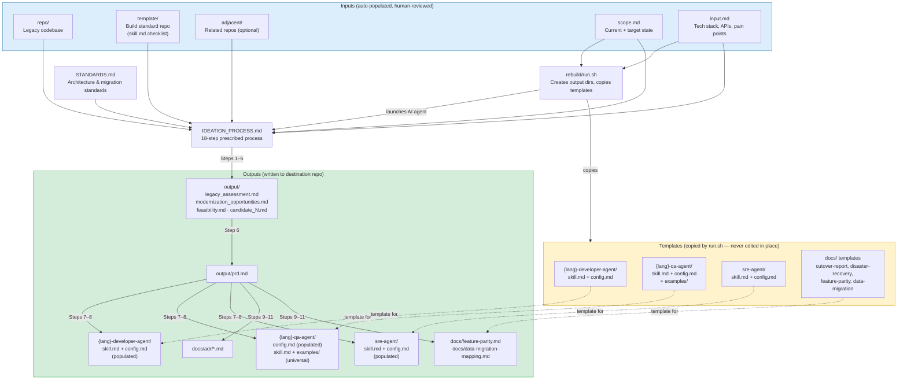
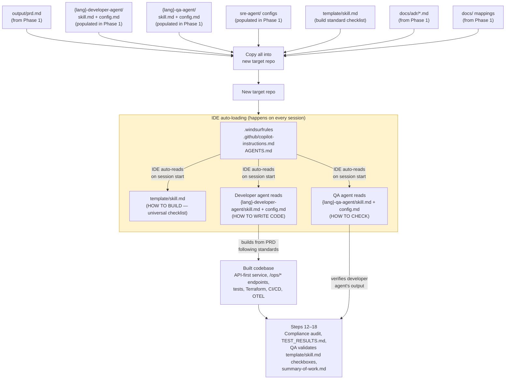
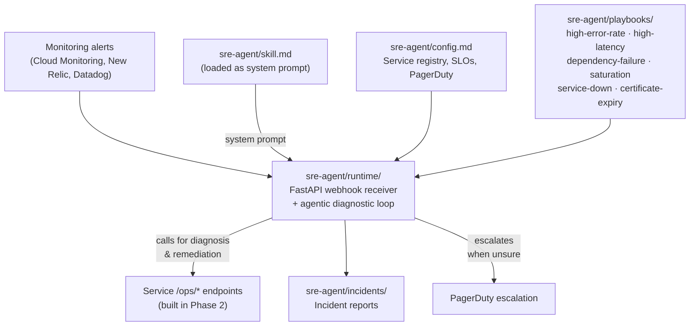

# Architecture & File Map

Visual diagrams of the three-phase workflow and a reference table for every file in the template.

> **[Download all diagrams as PDF](../rebuilder-architecture-diagrams.pdf)**

---

## Overview — Three Phases

Each phase feeds into the next.

```mermaid
flowchart LR
    subgraph P1 ["Phase 1 — Analyze"]
        direction TB
        IN["scope.md + input.md<br/>repo/ + template/ + adjacent/"]
        RUN["run.sh → IDEATION_PROCESS.md<br/>(18 steps)"]
        OUT["PRD, ADRs, agent configs,<br/>feature parity, data mapping"]
        IN --> RUN --> OUT
    end

    subgraph P2 ["Phase 2 — Build"]
        direction TB
        COPY["Copy configs →<br/>new target repo"]
        SHIM["IDE shim auto-loads<br/>{lang}-developer-agent/skill.md<br/>+ config.md + template/skill.md"]
        BUILD["AI agent builds service<br/>from PRD + standards"]
        COPY --> SHIM --> BUILD
    end

    subgraph P3 ["Phase 3 — Operate"]
        direction TB
        ALERT["Monitoring alert fires"]
        SRE["SRE agent diagnoses<br/>via /ops/* endpoints"]
        ACT["Remediates or<br/>escalates to PagerDuty"]
        ALERT --> SRE --> ACT
    end

    OUT -->|"populated configs + PRD"| COPY
    BUILD -->|"deployed service with<br/>/ops/* endpoints"| ALERT

    style P1 fill:#e8f4f8,stroke:#2c7bb6
    style P2 fill:#e8f0e4,stroke:#4daf4a
    style P3 fill:#fef3e0,stroke:#ff7f00
```

---

## The Three skill.md Files

Every rebuilt service uses three `skill.md` files. They serve different purposes, are loaded at different times, and come from different sources.

|  | `template/skill.md` | `{lang}-developer-agent/skill.md` | `{lang}-qa-agent/skill.md` |
|---|---|---|---|
| **Purpose** | Universal build standard — HOW TO BUILD | Project-specific coding rules — HOW TO WRITE CODE | Verification procedures — HOW TO CHECK |
| **Scope** | Same for every Evergreen rebuild (per language) | Populated per project | Populated per project |
| **Loaded** | Auto-loaded every IDE session via `.windsurfrules` + explicitly before Build phase and QA audit | Auto-loaded every IDE session via `.windsurfrules` | On demand via `/qa` workflow or Step 12 |
| **Format** | Checkboxes (auditable punch list) | Prose rules (behavioral instructions) | Verification procedures + acceptance criteria |
| **Mutability** | Immutable — org-wide standard | Customized per project | Customized per project |
| **Source** | `rebuilder-evergreen-template-repo-{lang}` | Built on demand from `rebuilder-template` (Step 8a) | Built on demand from `rebuilder-template` (Step 8d) |

---

## Phase 1 — Analyze (detail)

`run.sh` copies templates into the project directory and invokes the AI agent, which follows `IDEATION_PROCESS.md` to produce all outputs.

---

## Phase 2 — Build (detail)

Phase 1 outputs are copied into a new repo. IDE shim files auto-load the developer and QA agent standards on every session.

---

## Phase 3 — Operate (detail)

The SRE agent receives monitoring alerts, diagnoses issues via the service's `/ops/*` endpoints, and remediates or escalates.

---

## Which File Does What

The rebuilder is a fully automated process — the AI agent reads the legacy codebase and populates all files. Humans review and adjust before proceeding, but do not need to fill anything out manually.

| File | Role | When It's Used |
|---|---|---|
| `scope.md` | Defines current app + target state | Auto-populated from legacy code; human reviews/adjusts before proceeding |
| `rebuild/input.md` | Detailed tech stack, APIs, pain points | Auto-populated from legacy code; human reviews/adjusts before proceeding |
| `rebuild/run.sh` | Creates output dirs, copies templates, launches AI agent | Start of Phase 1 |
| `rebuild/IDEATION_PROCESS.md` | 18-step prescribed analysis + build process | AI agent follows during Phases 1 & 2 |
| `STANDARDS.md` | Architecture, scaling, security, testing standards | Referenced throughout all phases |
| `AGENTS.md` | Cross-tool agent bootstrap — points all AI tools to agent files | Always-on in Windsurf; depends on tool support elsewhere |
| `.windsurfrules` | IDE shim — tells Windsurf to read `template/skill.md`, `{lang}-developer-agent/skill.md + config.md`, and `{lang}-qa-agent/skill.md + config.md` | Auto-read by Windsurf on every session start |
| `.github/copilot-instructions.md` | IDE shim — tells VS Code Copilot to read `template/skill.md`, `{lang}-developer-agent/skill.md + config.md`, and `{lang}-qa-agent/skill.md + config.md` | Auto-included in every Copilot Chat interaction |
| `.windsurf/skills/legacy-rebuild/` | Windsurf Skill — progressive disclosure entry point for the rebuild process | Invoked on demand when user says "rebuild" or "replicator" |
| `{lang}-developer-agent/skill.md` | Dev coding standards (template → populated) | Template in Phase 1; auto-loaded by IDE shims in Phase 2 |
| `{lang}-developer-agent/config.md` | Project-specific dev config (template → populated) | Template in Phase 1; auto-loaded by IDE shims in Phase 2 |
| `{lang}-qa-agent/skill.md` | QA verification procedures + quality gates | Template in Phase 1; auto-loaded by IDE shims in Phase 2 |
| `{lang}-qa-agent/config.md` | Project-specific QA config (template → populated) | Template in Phase 1; auto-loaded by IDE shims in Phase 2 |
| `performance-agent/skill.md` | Python profiling tools, optimization patterns, best practices | On-demand — reference when investigating performance issues |
| `performance-agent/config.md` | Per-project performance targets, hot paths, infrastructure context | On-demand — filled per project |
| `sre-agent/skill.md` | SRE diagnostic workflow + safety constraints | Template in Phase 1; system prompt in Phase 3 |
| `sre-agent/config.md` | Service registry, SLOs, PagerDuty config | Template in Phase 1; runtime config in Phase 3 |
| `sre-agent/playbooks/*.md` | Remediation runbooks by incident type | Phase 3 — agent follows during incidents |
| `sre-agent/runtime/` | Deployable FastAPI service for alert handling | Phase 3 — receives webhooks, runs agentic loop |
| `template/skill.md` | Build standard checklist from template repo — HOW TO BUILD (tooling, CI, Dockerfile, Helm, coding practices) | Auto-loaded every IDE session via `.windsurfrules`; QA validates every checkbox in Phase 2; stays in built repo |
| `docs/*.md` | Migration planning templates (feature parity, data mapping, DR, cutover) | Templates copied in Phase 1; filled during Phases 1–2 |
| `output/*.md` | Analysis artifacts + PRD | Written by AI agent in Phase 1 |
