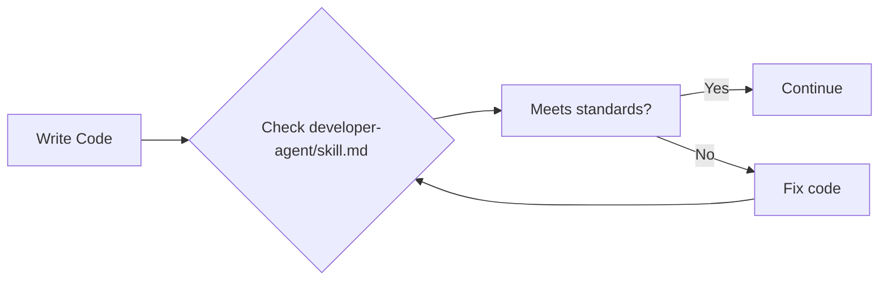
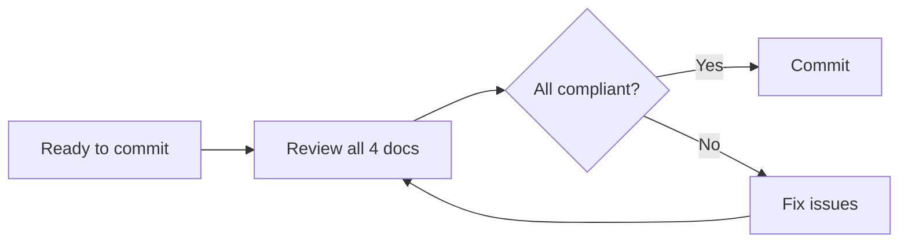
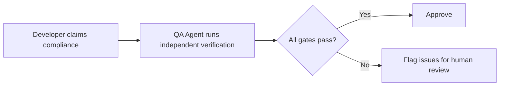

# Standards Loading and Verification Process

This document articulates exactly WHERE and WHEN each standards document is loaded and referenced throughout the rebuild process. Understanding this flow is critical for ensuring compliance and quality.

## Standards Documents Overview

| Document | Purpose | When It's Loaded | Who Enforces It |
|---|---|---|---|
| **STANDARDS.md** | Architecture, infrastructure, migration patterns | Phase 1: Steps 2, 3, 6 | AI Agent (analysis) + Human (review) |
| **template-repo-python/skill.md** | Build standard checklist (HOW TO BUILD) | Phase 2: Step 12 (first) + continuously | Developer Agent + QA Agent |
| **python-developer-agent/skill.md** | Coding standards (HOW TO WRITE CODE) | Phase 2: Step 12 (first) + continuously | Developer Agent |
| **python-qa-agent/skill.md** | Verification procedures (HOW TO CHECK) | Phase 2: Step 12 (first) + Step 17 | QA Agent |

## Phase-by-Phase Loading and Verification

### Phase 1: Analyze (Steps 1-11)

#### Step 2: Analyze Legacy Codebase
- **STANDARDS.md** → **READ** for evaluation criteria
  - Architecture assessment patterns
  - Infrastructure migration guidelines
  - Data migration strategies
- **Other docs**: NOT loaded yet (build standards not needed for analysis)

#### Step 3: Assess Current State
- **STANDARDS.md** → **REFERENCE** for assessment framework
  - Use architecture health criteria
  - Apply infrastructure standards
  - Evaluate against migration patterns

#### Step 6: Create PRD
- **STANDARDS.md** → **ACTIVE REFERENCE** for target state design
  - Ensure PRD aligns with architectural principles
  - Validate infrastructure choices against standards
  - Include compliance requirements from STANDARDS.md

### Phase 2: Build (Steps 12-18)

#### Step 12: Create New Target Repo ⭐ CRITICAL LOADING POINT
All agent standards are loaded here via IDE instruction files:

```
.windsurfrules (Windsurf) OR .github/copilot-instructions.md (VS Code)
    ↓
Loads: template-repo-python/skill.md (HOW TO BUILD)
       python-developer-agent/skill.md (HOW TO WRITE CODE)  
       python-qa-agent/skill.md (HOW TO CHECK)
```

**First time reading:**
- **template-repo-python/skill.md** → Build standard checklist
- **python-developer-agent/skill.md** → Coding practices and rules
- **python-qa-agent/skill.md** → Quality gates and verification procedures

#### Step 13: Bootstrap Service Structure
**ACTIVE REFERENCE - All three docs:**

**template-repo-python/skill.md** - Check each item as implemented:
- [ ] API-first design with `/ops/*` endpoints
- [ ] FastAPI application structure
- [ ] OpenTelemetry instrumentation
- [ ] Dockerfile with multi-stage build
- [ ] entrypoint.sh with proper signal handling
- [ ] Terraform Cloud Run deployment
- [ ] GitHub Actions CI/CD pipeline

**python-developer-agent/skill.md** - Follow coding standards:
- PEP 8 compliance, Black formatting
- Error handling patterns
- Security requirements
- Input validation standards

**STANDARDS.md** - Reference infrastructure patterns:
- Docker build best practices
- Environment variable validation
- Logging to stdout/stderr
- IaC security scanning requirements

#### Step 14: Implement Core Business Logic
**CONTINUOUS REFERENCE:**

**python-developer-agent/skill.md** - Every line of code:
- "Does this follow the coding standards?"
- "Is error handling compliant?"
- "Are security requirements met?"

**STANDARDS.md** - Architectural decisions:
- "Does this align with migration patterns?"
- "Are data flows compliant with standards?"

#### Step 15: Add Testing Infrastructure
**ACTIVE REFERENCE:**

**python-qa-agent/skill.md** - Test implementation:
- 5-level test strategy
- `/ops/*` endpoint contract tests
- Mock strategies for external dependencies
- Coverage requirements

**template-repo-python/skill.md** - Verify test structure matches template

#### Step 16: Set Up CI/CD and Infrastructure
**ACTIVE REFERENCE:**

**template-repo-python/skill.md** - CI/CD checklist:
- [ ] GitHub Actions matches template
- [ ] Terraform structure compliance
- [ ] Environment promotion flow
- [ ] Coverage reports in PR comments
- [ ] WIZ IaC scanning integration

**STANDARDS.md** - Infrastructure standards:
- Terraform workflows
- Environment variable validation
- Logging standards

#### Step 17: Run Quality Gates ⭐ CRITICAL VERIFICATION POINT
**ENFORCEMENT POINT:**

**python-qa-agent/skill.md** - Execute all quality gates:
- pytest, pylint, black, mypy, pip-audit, interrogate, complexipy
- `/ops/*` endpoint compliance verification
- Template conformance checks

**template-repo-python/skill.md** - Final checklist verification:
- Every checkbox must be complete
- Build standard fully implemented

**python-developer-agent/skill.md** - Verify coding standard compliance

## Continuous Verification Loop

### During Development


### Before Each Commit


### Quality Gate Execution


## IDE Loading Mechanisms

### Windsurf
- `.windsurfrules` → Auto-loads all agent files on session start
- Always-on awareness of all standards

### VS Code + Copilot
- `.github/copilot-instructions.md` → Loads agent files on every interaction
- Context-aware for each prompt

### Manual Loading (Other Tools)
- `AGENTS.md` → Cross-tool standard
- Manual reference when needed

## Verification Responsibilities

| Role | Primary Documents | Verification Method |
|---|---|---|
| **AI Agent (Phase 1)** | STANDARDS.md | Analysis and assessment |
| **Developer Agent** | python-developer-agent/skill.md | Continuous coding compliance |
| **QA Agent** | python-qa-agent/skill.md | Independent quality gate execution |
| **Human Reviewer** | All documents | Final approval and business logic validation |

## Critical Success Factors

1. **Early Loading** - All standards loaded before first line of code (Step 12)
2. **Continuous Reference** - Standards consulted during every implementation decision
3. **Independent Verification** - QA agent validates developer agent work
4. **Human Oversight** - Business logic and architectural decisions reviewed
5. **Checklist Completion** - template-repo-python/skill.md checkboxes tracked throughout

## Failure Points to Avoid

- ❌ Loading standards after starting implementation
- ❌ Referencing only one standard document
- ❌ Skipping independent QA verification
- ❌ Not completing template-repo-python/skill.md checklist
- ❌ Ignoring STANDARDS.md architectural requirements

This process ensures no standards are missed and quality is built into every step of the rebuild process.
