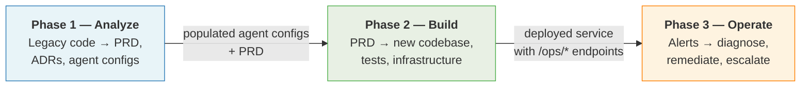
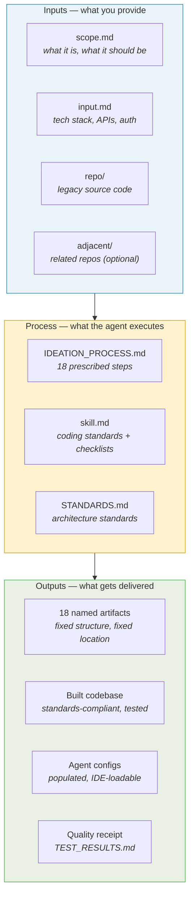
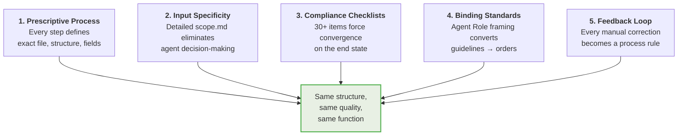
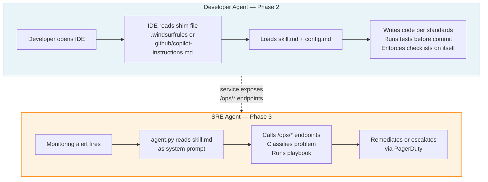
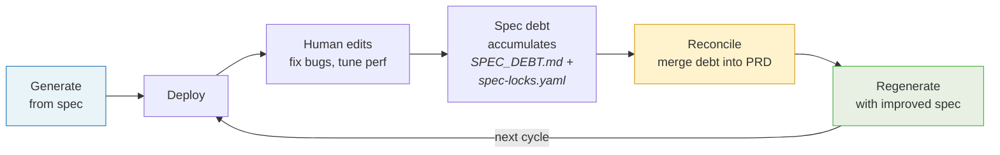
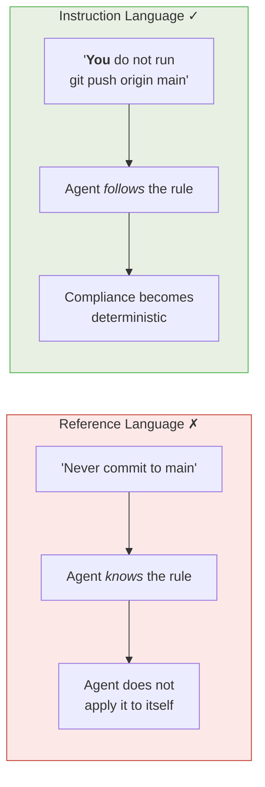

# Spec-Driven Development — Visual Overview

> Quick-reference companion to [spec-driven-development.md](../spec-driven-development.md).
> Start here for the picture; go there for the full explanation.

---

## Three Phases

Every Replicator rebuild follows the same three phases.
The output of each phase feeds the next.

---

## The Contract — Inputs, Process, Outputs

The process constrains the LLM to **fill in values**, not decide what the structure is.
Same inputs + same process = same outputs (structure, quality, function).

---

## Five Reproducibility Mechanisms

These work together to ensure two independent agents, given the same inputs, arrive at the same destination.

---

## Two Agents, Same Pattern

Both agents use the same two-file pattern: **skill.md** (how to act) + **config.md** (what to act on).

**Both agents are stateless.** Every session starts from the skill file on disk.
Change the document → change the behavior. No retraining, no redeployment.

---

## After Day 1 — The Convergence Loop

Generated code doesn't stay generated. Engineers fix bugs, handle edge cases, and tune performance.
Two mechanisms keep the spec and code convergent over time:

| Mechanism | What it does |
|---|---|
| **Spec-Impact PR Gate** | Every human PR maps changes to PRD sections. Engineer explains the divergence. Entry logged to `SPEC_DEBT.md`. |
| **Spec-Lock Annotations** | Code blocks the spec can't express (`@spec-lock`) are preserved across regeneration. |

Each cycle, the spec absorbs what humans taught it. Lock count should **decrease** over time:

| Locks | Meaning |
|---|---|
| 0 | Spec is complete (or nobody is editing — investigate) |
| 1–5 | Healthy — a few edge cases |
| 6–15 | Spec has gaps — reconcile before next rebuild |
| 15+ | Spec needs a rewrite |

---

## The Key Insight — Reference vs. Instruction

The single biggest lesson from the first rebuild: **how you write standards determines whether the agent follows them.**

| Pattern (weak) | Fix (strong) |
|---|---|
| "The team should…" | "**You** must…" |
| "Best practices include…" | "Before [action], **you** always [step]." |
| "Avoid committing secrets." | "Before every commit, **you** run `grep -r 'API_KEY' .`" |

---

## The Mental Model

> Think **structured form with LLM-powered fill-in**, not creative writing with LLM-powered imagination.

| Analogy | What varies | What doesn't |
|---|---|---|
| Tax software | The numbers | The form, the rules, the validation |
| Building inspection | The house design | The checklist, the safety minimums |
| **Replicator rebuild** | **Prose, micro-decisions** | **Artifacts, structure, quality gates** |
